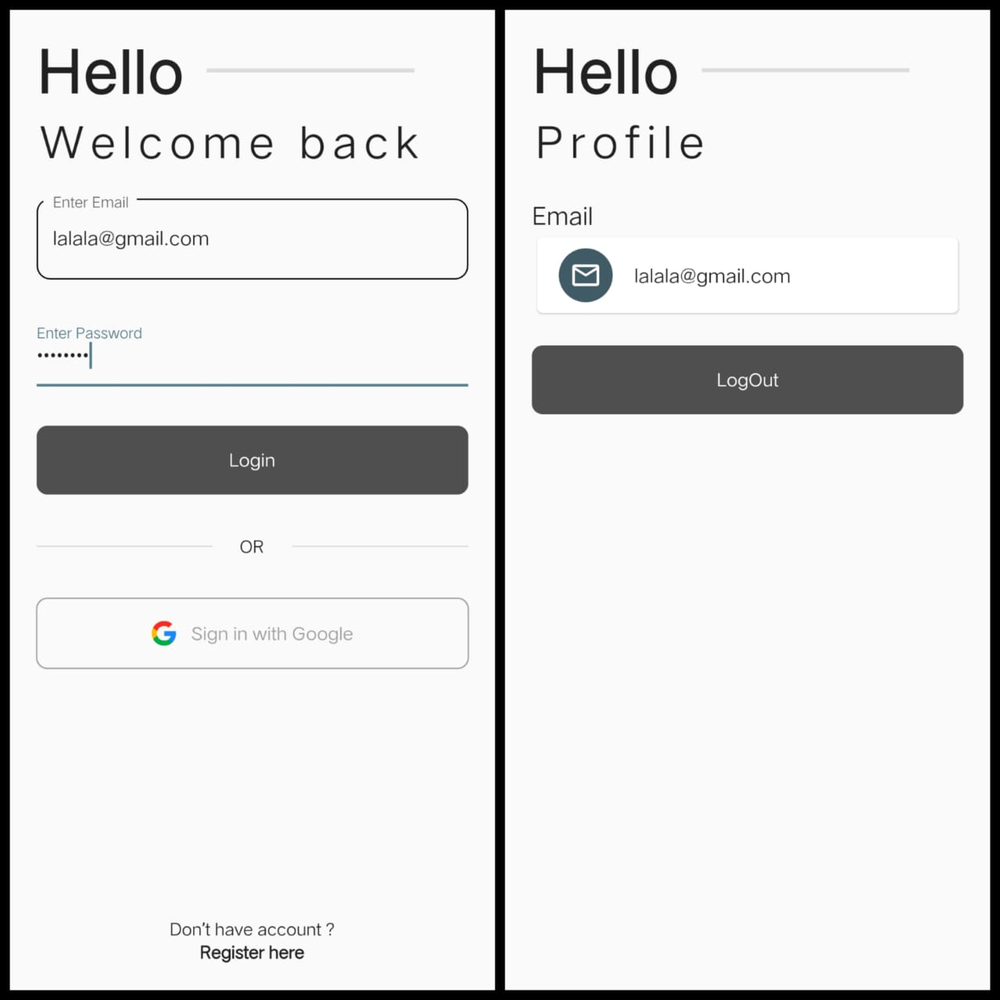

# Jobsheet 8 - Firebase

## Halaman Home

Pada halaman ini terdapat 2 pilihan login, yang pertama yaitu login menggunakan email dan password. Dan yang kedua yaitu login with google account

## Login menggunakan email dan password

Agar bisa melakukan login menggunakan email dan password, maka perlu melakukan register terlebih dahulu.

Klik Register Here, kemudian pada halaman register masukkan email dan password. Setelah berhasil melakukan register maka akan menuju ke halaman profile. Pada halaman profile ini akan menampilkan alamat email yang digunakan untuk register.

Setelah melakukan register maka sudah dapat melakukan login menggunakan email dan password. Masukkan email dan password yang sudah diregistrasikan. Jika login berhasil maka akan menuju kehalaman progile. Pada halaman profile ini akan menampilkan alamat email yang digunakan untuk login.

## Login menggunakan google account

Klik sign in with Google untuk melakukan login menggunakan google account. Kemudian pilih google account yang ingin digunakan. Jika berhasil maka akan menuju ke halaman profile. Pada halaman profile ini berisikan nama depan dan alamat google account yang digunakan untuk login.

## Error Message

Ketika terdapat kesalahan dalam melakukan proses login, maka akan muncul error message.

Penjelasan:
- 1 Ketika alamat email tidak sesuai dengan format.
- 2 Ketika password yang dimasukkan tidak sesuai.
- 3 Ketika email yang dimasukkan belum terdaftar.
- 4 Ketika email sudah pernah digunakan untuk register.
